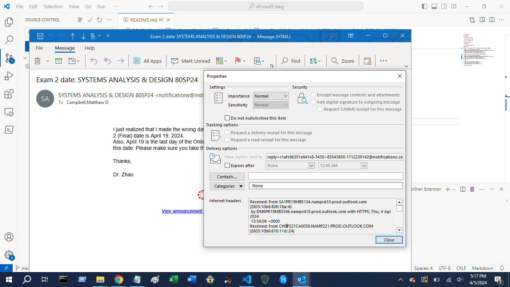
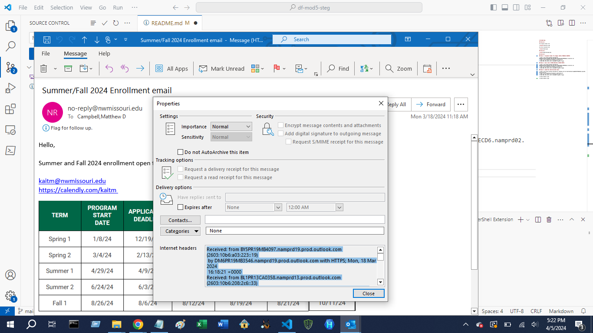

# df-mod5-steg

## Exercise 1

The original broken file:

The fully recovered file:

## Exercise 2

## Exercise 3

### Email 1: Assignment Graded: P4 & Engage, DIGITAL FORENSICS 8030SP24

1. What is the unique permanent Message-ID?: 0100018eaf2d7402-e313800b-cd48-44e8-8043-6aee26de19d0-000000@email.amazonses.com
2. What is the originating IP address?: 23.249.221.119
3. What does the server use for encryption?: TLS 1.2
4. What does the server use for hashing?: SHA256 or SHA38

### Email 2: Exam 2 date: SYSTEMS ANALYSIS & DESIGN 80SP24

1. What is the unique permanent Message-ID?: 0100018ea967efd0-a2958fd5-f851-46af-aa53-a45d6adb806e-000000@email.amazonses.com
2. What is the originating IP address?: 54.240.127.61
3. What does the server use for encryption?: TLS 1.2
4. What does the server use for hashing?: SHA256 or SHA38

### Email 3: Summer/Fall 2024 Enrollment email

1. What is the unique permanent Message-ID?: 8e39e482-c57f-4cf7-8b79-88f4be77c2d6@MN1PEPF0000ECD6.namprd02.prod.outlook.com
2. What is the originating IP address?: 198.209.246.111
3. What does the server use for encryption?: TLS 1.2
4. What does the server use for hashing?: SHA256 or SHA38

