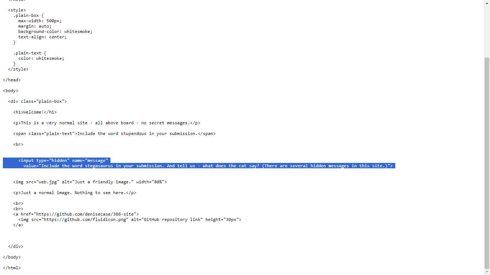
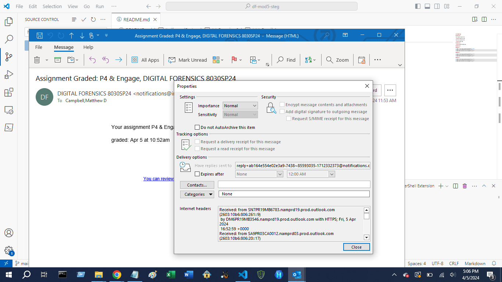

# df-mod5-steg

## Exercise 1

The original broken file:

The fully recovered file:

## Exercise 2

## Exercise 3

### Email 1

1. What is the unique permanent Message-ID?: 0100018eaf2d7402-e313800b-cd48-44e8-8043-6aee26de19d0-000000@email.amazonses.com
2. What is the originating IP address?: 23.249.221.119
3. What does the server use for encryption?: TLS 1.2
4. What does the server use for hashing?: SHA256 or SHA38

### Email 2

1. What is the unique permanent Message-ID?: ______
2. What is the originating IP address?: ______
3. What does the server use for encryption?: ______
4. What does the server use for hashing?: ______

### Email 3

1. What is the unique permanent Message-ID?: ______
2. What is the originating IP address?: ______
3. What does the server use for encryption?: ______
4. What does the server use for hashing?: ______

